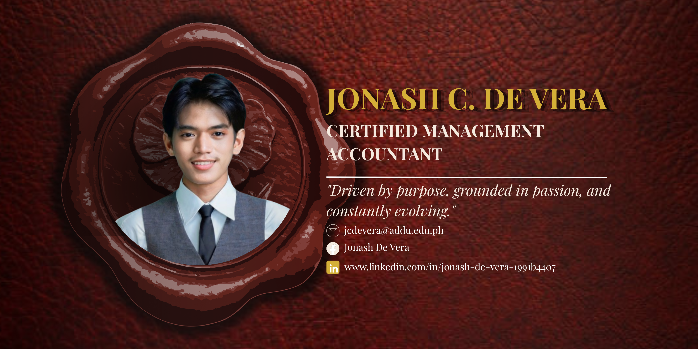
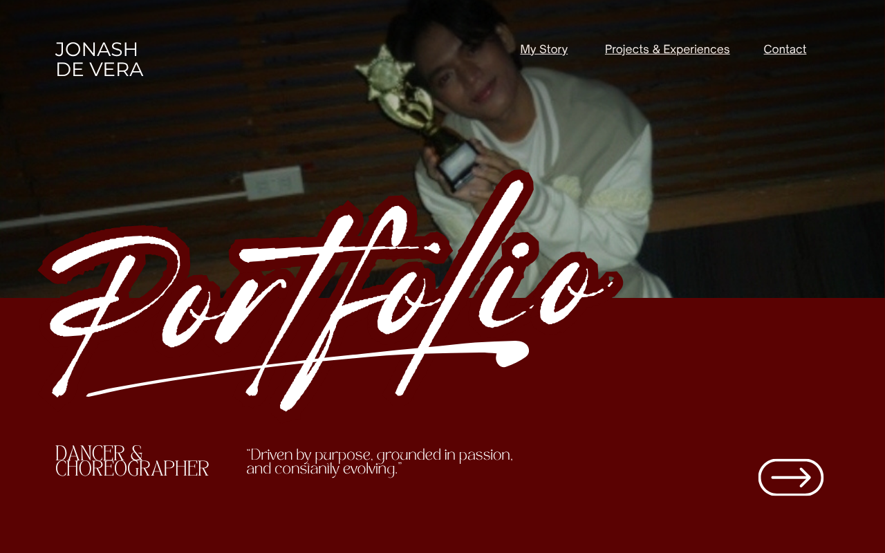
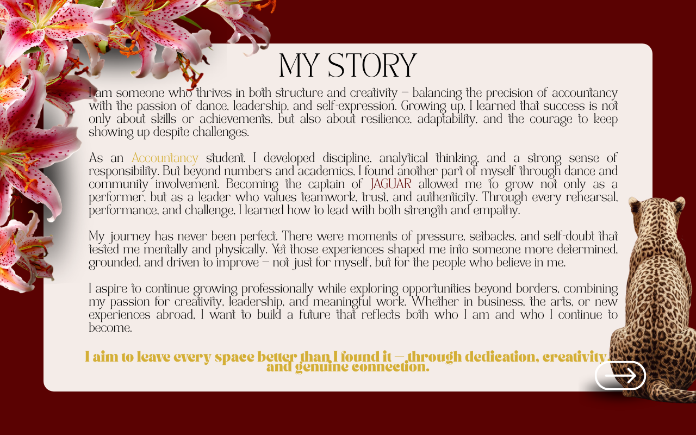
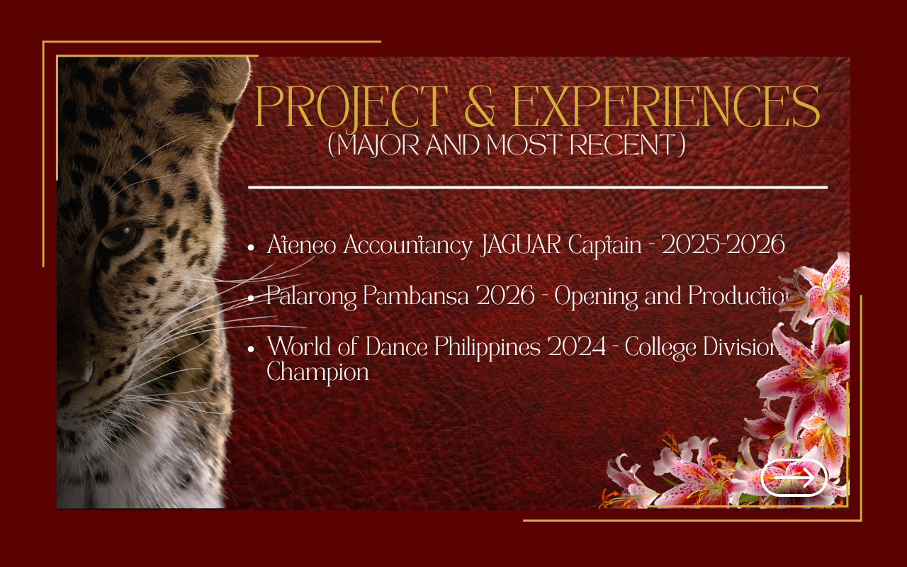
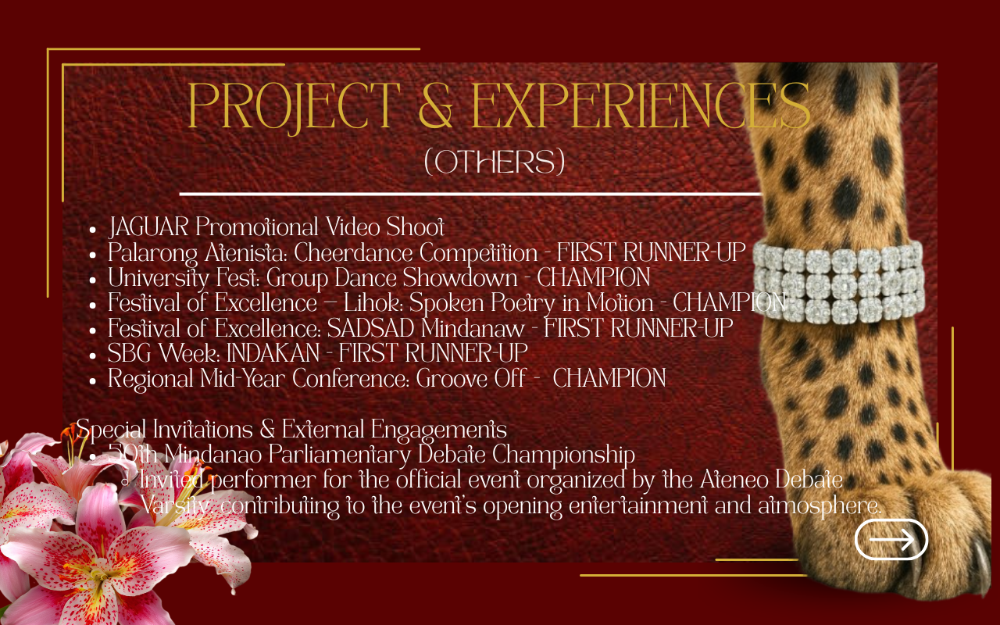
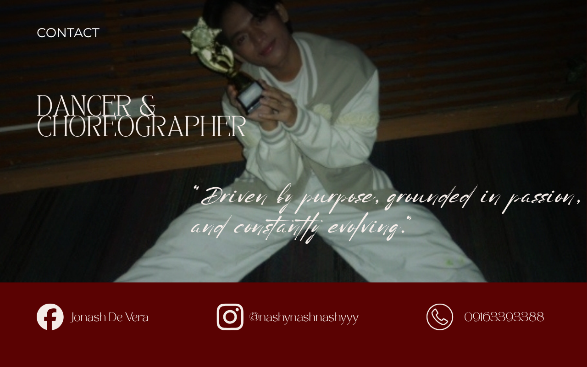

# Jonash De Vera Portfolio Website

## About Me

Hi! I'm **Jonash De Vera**, an Accountancy student, dancer, choreographer, and creative designer passionate about combining storytelling, performance, and visual design. My work reflects a commitment to showcasing both artistic expression and professional growth through meaningful digital experiences.

> **"Driven by purpose, grounded in passion, and constantly evolving."**

---

# Portfolio Website Project

This project is a personal portfolio website designed to highlight my journey as a dancer, choreographer, performer, and student leader. The website presents my story, accomplishments, experiences, and contact information through a visually cohesive and personality-driven interface.

---

## Homepage

### Reflection
The homepage was designed to establish a strong first impression through bold typography, warm color palettes, and a featured portrait. I wanted visitors to immediately recognize both my creative identity and professional aspirations through a clean yet expressive layout.

---

## My Story

### Reflection
This section focuses on personal storytelling and self-expression. The floral elements, warm colors, and textured background were intentionally selected to create a reflective atmosphere that communicates growth, passion, and authenticity.

---

## 🏆 Projects & Experiences (Major Achievements)

### Reflection
I organized my major experiences and accomplishments into a structured layout that allows visitors to quickly understand my most significant milestones. The design balances visual appeal and readability to effectively showcase achievements without overwhelming the audience.

---

## Projects & Experiences (Additional Achievements)

### Reflection
This section expands on my portfolio by presenting additional experiences that contributed to my development as a performer, leader, and creative individual. Maintaining the same visual language across sections ensures consistency and strengthens the overall branding of the website.

---

## Contact Page

### Reflection
The contact page was designed with simplicity and accessibility in mind. By providing clear communication channels and social media links, visitors can easily connect with me while experiencing a design that remains consistent with the rest of the portfolio.

---

# Design Philosophy

The website combines elegance, creativity, and personal storytelling. Burgundy tones, floral accents, and curated imagery were chosen to reflect passion, artistic expression, and individuality while maintaining a professional and organized presentation.

---

# Technologies Used

- Canva

---

# Author

**Jonash De Vera**

Dancer • Choreographer • Creative Designer

*"Driven by purpose, grounded in passion, and constantly evolving."*

1. BIR Annual Report 2024
2. DTI MSME Development Report 2023
3. World Bank Doing Business Report
4. Relevant peer-reviewed journal articles
